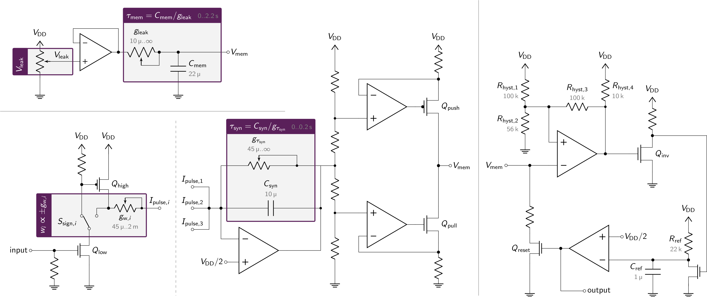

# Lu.i[¹](#footnote-1) – An educational neuron PCB

Lu.i is an electronic neuron circuit mimicking and illustrating the basic dynamics of real, biological neurons.
The printed circuit board (PCB) features a configurable, fully analog implementation of the leaky integrate-and-fire model and visualizes the internal state, the *membrane potential*, through a VU-meter-style chain of LEDs.
The neuron emits a short pulse whenever the membrane potential crosses a predefined threshold voltage.
Neurons communicate by exchanging these *spikes*.
Multiple boards can be connected via jumper wires to form networks.

 

For a more detailed write-up you may refer to our manuscript:

**Lu. i – A low-cost electronic neuron for education and outreach.**  
Yannik Stradmann, Julian Göltz, Mihai A. Petrovici, Johannes Schemmel, Sebastian Billaudelle (2025)  
Trends in Neuroscience and Education, Volume 38, 100248  
[10.1016/j.tine.2025.100248](https://doi.org/10.1016/j.tine.2025.100248)

For inquiries feel free to contact us at [info@giantaxon.org](mailto:info@giantaxon.org).

## Features
- fully analog implementation of the leaky integrate-and-fire model
- configurable leak potential and membrane time constant
- three synapses with tunable weight and sign (excitatory or inhibitory) and shared synaptic time constant
- three output terminals to forward spikes to other neurons
- powered by a CR2032 coin battery
- Arduino-compatible (5V-tolerant spike IO)
- VU-meter-style visualization of the membrane potential and spike LED
- optimized for low-cost production (~ 3 € per neuron)

## Example Networks
Resembling the structure of the nervous system, multiple *Lu.i* boards can be connected to form complex neural networks.
They may be used for illustrative purposes, mimicking biological behavior, or even solving functional tasks.
The following hierarchical network, e.g., implements an *exclusive OR* (XOR).

For a more extensive list of example networks please refer to [Lu.i's documentation](doc/).

## Model
The neuron implemented on the PCBs is called Leaky Integrate-and-Fire (LIF) model.
For this model, the membrane voltage follows the dynamics described by the differential equation

$$
    \tau_\text{mem} \frac{\mathrm{d}V_\text{mem}}{\mathrm{d}t} = - \left(V_\text{mem} - V_\text{leak} \right) + I_{\text{syn}} / g_\text{leak}.
$$

In short, the neuron sums up its input $I_\text{syn}$ and decays back to the leak voltage $V_\text{leak}$.
The LIF model, including the spiking behavior when the threshold is reached, is implemented in electric circuits.

## Electronic Implementation
The following circuit diagram shows the different functional blocks of the analog implementation on *Lu.i*.
The full schematics are given as KiCAD design files.

Besides the formation of synaptic connections between the individual neurons, inputs and outputs of each *Lu.i* can also be used to connect with a wide range of microcontrollers and sensors.
Example code can be found in the [documentation](doc/). 

## Manufacturing
The component choice in the *Lu.i* design is optimized for manufacturing at [JLCPCB](https://jlcpcb.com/).
With every [release](../../releases/), we include all the design files necessary for production.
Detailed instructions on the ordering process can be found in the [documentation](doc/).

---

<a name="footnote-1">¹</a> The name »Lu.i« (phonetic notation of »Louis«) is a tribute to Louis E. Lapicque, who first formulated the leaky integrate-and-fire equations modeling the dynamics of a neuron.
