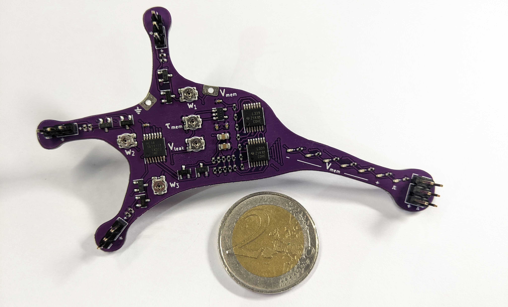
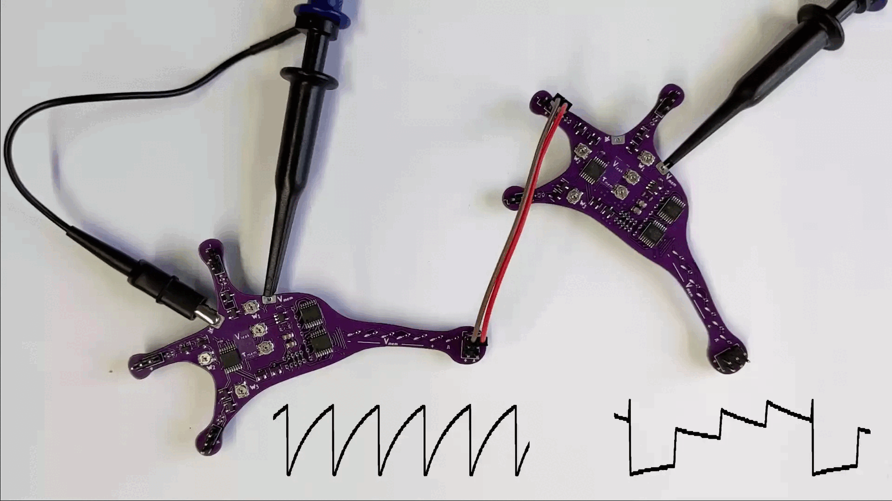
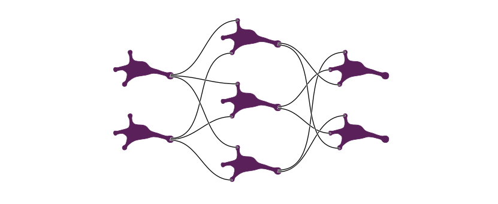

# Lu.i[¹](#footnote-1) – an educational neuron PCB

Lu.i is an electronic neuron circuit mimicking and illustrating the basic dynamics of real, biological neurons.
The printed circuit board (PCB) features a configurable, fully analog implementation of the leaky integrate-and-fire model and visualizes the internal state, the *membrane potential*, through a VU-meter-style chain of LEDs.
The neuron emits a short pulse whenever the membrane potential crosses a predefined threshold voltage.
Neurons communicate by exchanging these *spikes*.
Multiple boards can be connected via jumper wires to form networks.

## Features

- fully analog implementation of the leaky integrate-and-fire model
- configurable leak potential and membrane time constant
- three synapses with tunable weight and sign (excitatory or inhibitory)
- three output terminals to forward spikes to other neurons
- VU-meter-style visualization of the membrane potential and spike LED
- optimized for low-cost production (~ 3 € per neuron)

## Circuits

## Networks

## Fabrication

<a name="footnote-1">¹</a> The name »Lu.i« (phonetic notation of »Louis«) is a tribute to Louis E. Lapicque, who first formulated the leaky integrate-and-fire equations modeling the dynamics of a neuron.
