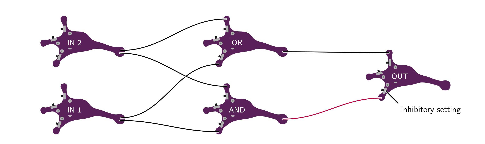

# Lu.i[¹](#footnote-1) – an educational neuron PCB

Lu.i is an electronic neuron circuit mimicking and illustrating the basic dynamics of real, biological neurons.
The printed circuit board (PCB) features a configurable, fully analog implementation of the leaky integrate-and-fire model and visualizes the internal state, the *membrane potential*, through a VU-meter-style chain of LEDs.
The neuron emits a short pulse whenever the membrane potential crosses a predefined threshold voltage.
Neurons communicate by exchanging these *spikes*.
Multiple boards can be connected via jumper wires to form networks.

## Features

- fully analog implementation of the leaky integrate-and-fire model
- configurable leak potential and membrane time constant
- three synapses with tunable weight and sign (excitatory or inhibitory)
- three output terminals to forward spikes to other neurons
- VU-meter-style visualization of the membrane potential and spike LED
- optimized for low-cost production (~ 3 € per neuron)

## Example Networks

Very much resembling the structure of the nervous system, multiple *lu.i* boards can be connected to form even complex neural networks.
The latter may simply serve illustrative purposes, mimick biological behavior, or even solve functional tasks.
The following hierarchical network, e.g., implements an *exclusive OR* (XOR).

For a more extensive list of example networks please refer to [lu.i's documentation](doc/example-networks.md).

## Model
The neuron implemented on the PCBs is called Leaky Integrate-and-Fire (LIF) model.
For this model, the membrane voltage follows the dynamics described by the differential equation

$$
    C_\text{mem} \frac{\mathrm{d}V_\text{mem}}{\mathrm{d}t} = - g_\text{leak} \left(V_\text{mem} - V_\text{leak} \right) + I_{\text{syn}}.
$$

In short, the neuron sums up its input $I_\text{syn}$ and decays back to the leak voltage $V_\text{leak}$.
The LIF model, including the spiking behavior when the threshold is reached can be implemented in electric circuits.

## Circuits

---

<a name="footnote-1">¹</a> The name »Lu.i« (phonetic notation of »Louis«) is a tribute to Louis E. Lapicque, who first formulated the leaky integrate-and-fire equations modeling the dynamics of a neuron.
