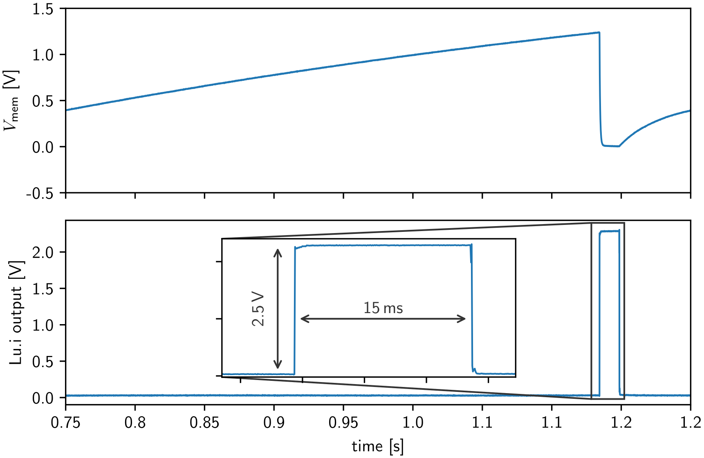

# Lu.i's electronic interface

Each *Lu.i* neuron receives synaptic stimuli and sends out spike events in the form of rectangular pulses.

## Output signals
Each efferent spike creates a low-impedance voltage pulse at the axonal terminal of *Lu.i*.
These pulses are approximately 15 ms long and have a signal level of 2.5 V:



## Input signals
*Lu.i* decodes any voltage pulses above 1.8 V as an input event.
The amplitude does not scale the strength of the corresponding current and may therefore be of any value between 1.8 V and 20 V.
The pulse width, however, linearly scales the effective weight.

Users may create such input stimuli by external microcontrollers or sensors.
To ensure similar effective weights for such "virtual" inputs compared to other *Lu.i* neurons, the pulse length should be approximately 15 ms long.

## Example: Stimulus generation with Arduino
Using the common [Arduino](https://www.arduino.cc/) framework, we can define a simple function to create input stimuli.
For example, we can create a regular-spaced spike train:
```cpp
// Arduino pin connected to the Lu.i synapse
static constexpr uint8_t NEURON_PIN = 5;

void send_spike(uint8_t neuron_pin)
{
	digitalWrite(neuron_pin, true);
	delay(15);  // 15ms pulse length
	digitalWrite(neuron_pin, false);
}

void setup()
{
	pinMode(NEURON_PIN, OUTPUT);
}

void loop()
{
	send_spike(NEURON_PIN);
	delay(500); // 500ms inter spike interval
}
```
