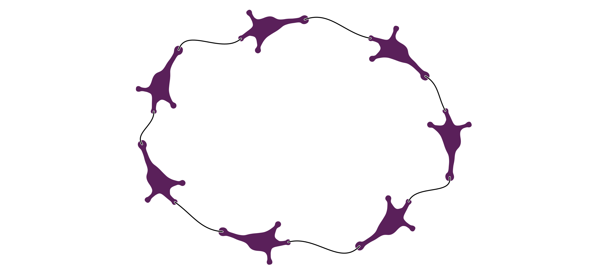
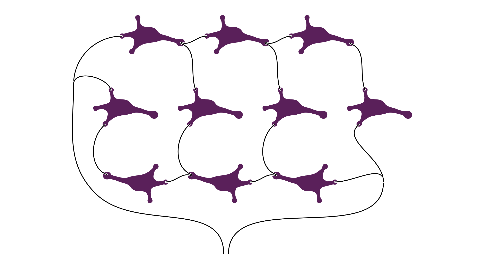
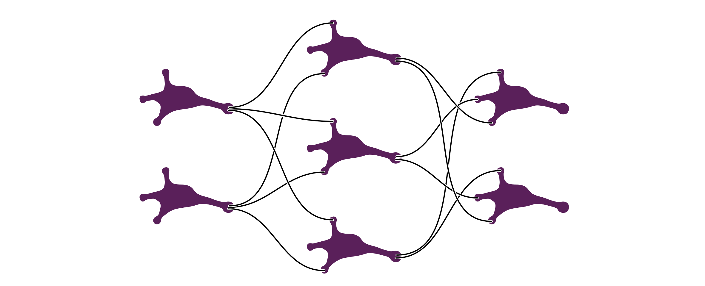
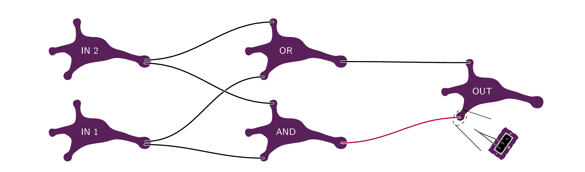
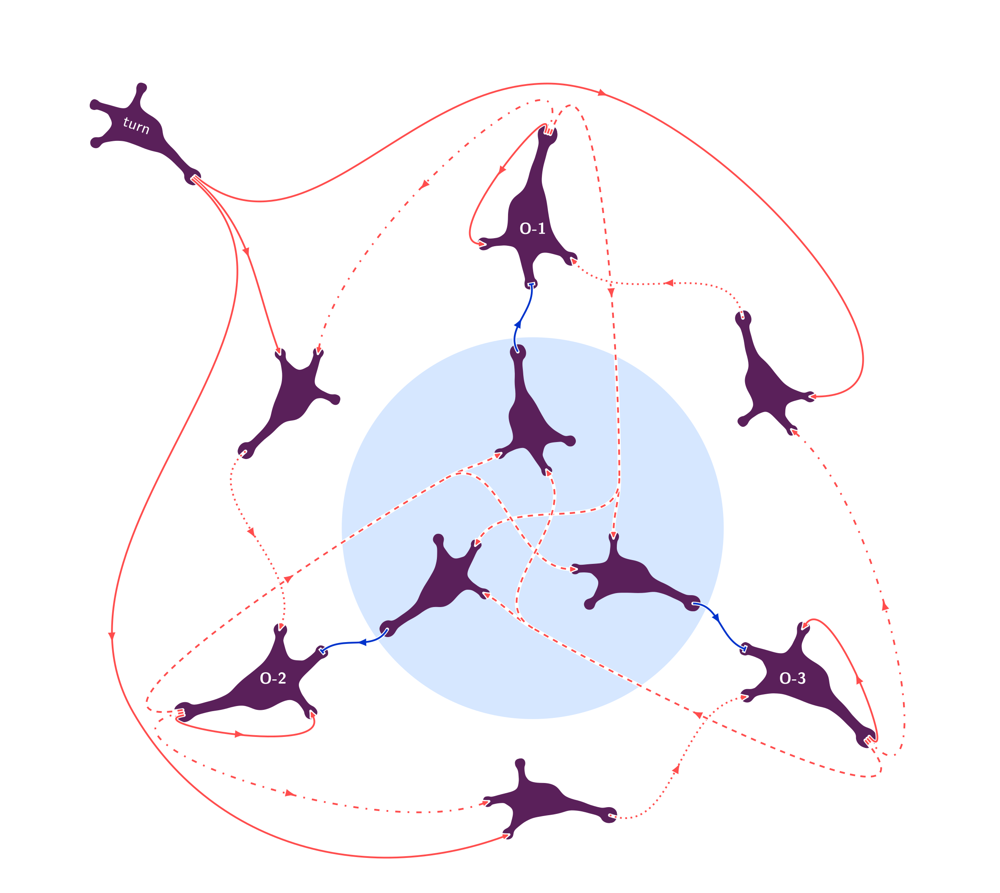

# Example networks

## Synfire chain

The name synfire chain is an abbreviation for synchronous firing chain and describes a circular feed-forward chain, in which activity travels from layer to layer.
When suitably configured, a spike in one of our neurons will elicit a consecutive spike in the next neuron in the chain.

This can also be put in a circular shape where the activity travels indefinitely.

Two synfirechains together with a set of coincidence-detecting neurons, can be used to realise a simplified version of the [Jeffress model](http://www.scholarpedia.org/article/Jeffress_model):
given two stimuli, their time difference determines which of the coincidence neurons is activated.

## General hierarchical network

## Solving the XOR problem rate based

## Ring attractor

